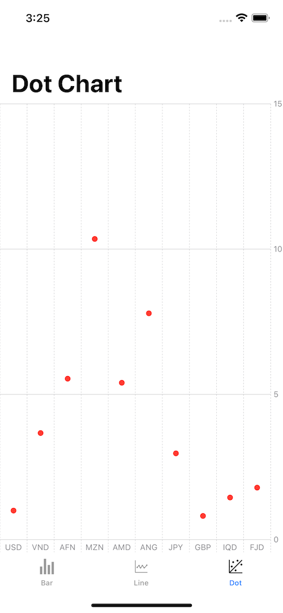

# SwiftUICharts
A SwiftUI view that displays a chart. Use a chart to build expressive and dynamic data visualizations inside a SwiftUI view. To create a chart, provide data as a random access collection of data elements to Chart.

## Quick Start

* Swift 5.7
* Macintosh with Xcode 14.0 (Requires Mac OS 12.4)

# Setup

To run this application you need only Xcode 14.0. Any other software or lib is not required.

## Contribution guidelines

All `public` interface should be well documented in the code.

For `internal` and `private` code we should not need any documentation as most of the time it should be self explanatory. Only when the implementation is quire comple we should add a comment.

## Status

| Topic | Version |
| ---- | ----|
| UITest Included| NO |
| Minimum iOS version | 16.0 |
| Swift Compatiblity | 5.7 |
| --- | --- |

## Code formatting

This project uses not using any formater / lint.

## Preview

